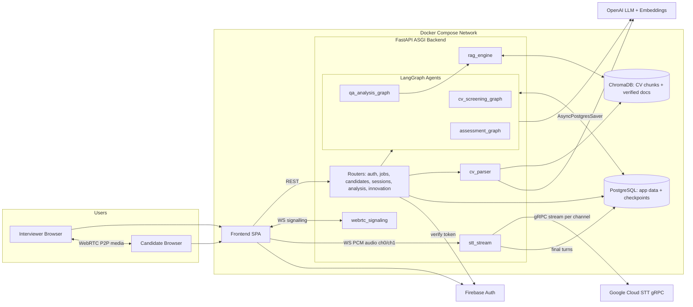
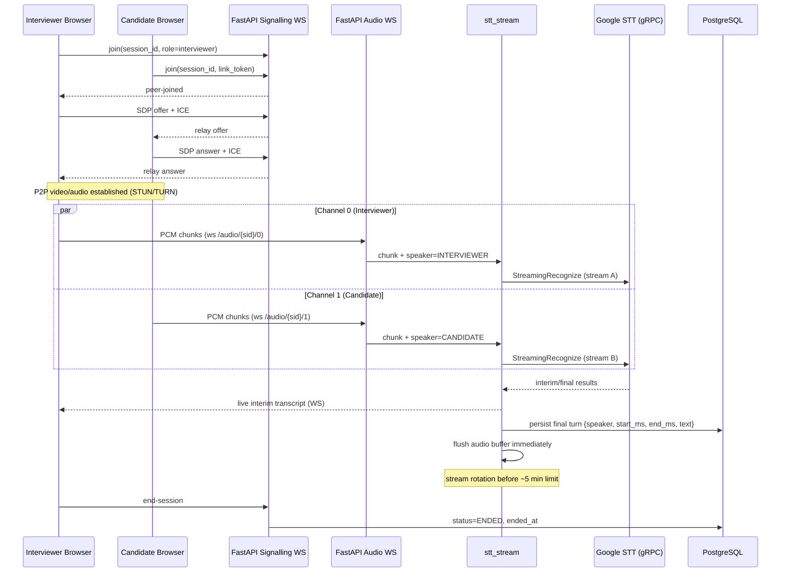
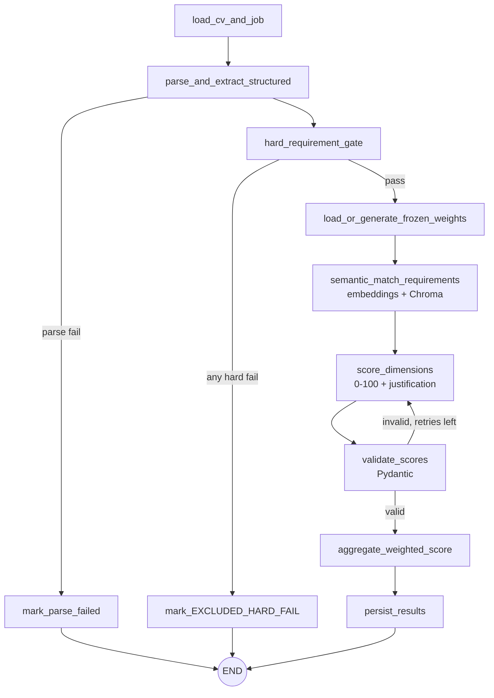
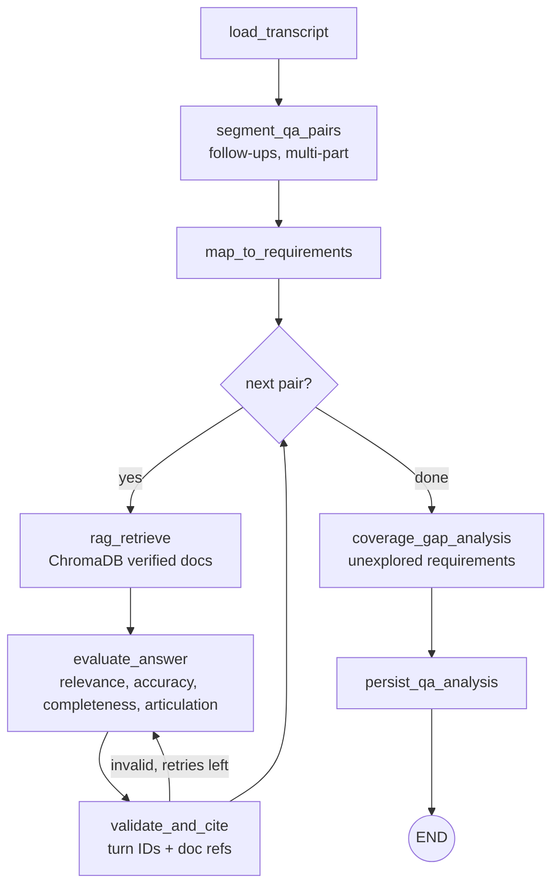
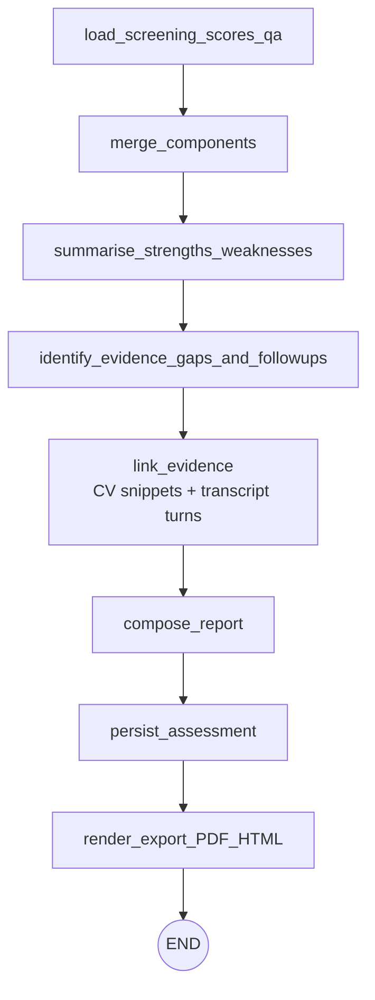

# Architecture Diagrams (P1.4)

> Draft scaffold. Per BID §13.2 (NA3) the workflow diagram must be your own work: use this as a starting point, then redraw and export `architecture_diagram.png` in your own style.

## 1. System Boundary (ASCII)

```
                        ┌───────────────────────────── Docker Compose network ─────────────────────────────┐
                        │                                                                                  │
 ┌──────────────┐  HTTPS │  ┌────────────┐   REST /api/v1     ┌───────────────────────────────────────┐   │
 │ Interviewer  │◄──────►│  │  Frontend  │◄──────────────────►│        FastAPI (ASGI / Uvicorn)       │   │
 │   Browser    │        │  │ (React SPA)│  WS: signalling    │  routers: auth jobs candidates        │   │
 └──────┬───────┘        │  └────────────┘  WS: audio ch0/1   │           sessions analysis innovation │   │
        │ WebRTC P2P     │                                     │  services: cv_parser stt_stream        │   │
        │ (video+audio)  │  ┌────────────┐                     │            rag_engine webrtc_signaling │   │
 ┌──────┴───────┐        │  │  Frontend  │◄───────────────────►│  agents (LangGraph):                   │   │
 │  Candidate   │◄──────►│  │(same SPA)  │                     │   cv_screening / qa_analysis /         │   │
 │   Browser    │        │  └────────────┘                     │   assessment                           │   │
 └──────────────┘        │                                     └───┬───────────┬───────────┬───────────┘   │
                         │                                         │           │           │               │
                         │                                 ┌───────▼──────┐ ┌──▼────────┐ │               │
                         │                                 │ PostgreSQL   │ │ ChromaDB  │ │               │
                         │                                 │ app data +   │ │ CV chunks │ │               │
                         │                                 │ LangGraph    │ │ + verified│ │               │
                         │                                 │ checkpoints  │ │ tech docs │ │               │
                         │                                 └──────────────┘ └───────────┘ │               │
                         └────────────────────────────────────────────────────────────────┼───────────────┘
                                                                                          │ outbound only
                              ┌──────────────────┬────────────────────┬───────────────────┘
                              ▼                  ▼                    ▼
                     Google Cloud STT       OpenAI API          Firebase Auth
                     (gRPC streaming,     (LLM + embeddings)    (role identity)
                      audio in memory)
```

## 2. System Context & Containers (Mermaid)



## 3. Dual-Channel WebRTC + STT Sequence

Video/audio between participants flows peer-to-peer. Independently, each browser taps its **own local microphone**, downsamples to 16 kHz PCM via an AudioWorklet, and streams chunks to the backend. The backend derives the channel from the authenticated role, never from client claims (risk R18). No audio is written to disk.



## 4. LangGraph Workflows

All graphs compile with `AsyncPostgresSaver` and are invoked with `config={"configurable": {"thread_id": ...}}`. On restart, invoking with the same `thread_id` resumes from the last checkpoint.

### 4.1 `cv_screening_graph` (F1 + F2) — thread_id: `cv:{candidate_id}`



State (`state.py`): `candidate_id, job_id, cv_text_ref, structured_cv, hard_gate_result, weights, requirement_matches, dimension_scores, aggregate, status, errors, retry_count`.

### 4.2 `qa_analysis_graph` (F5) — thread_id: `qa:{session_id}`



### 4.3 `assessment_graph` (F6) — thread_id: `assess:{candidate_id}:{session_id}`



## 5. Deployment Topology (Compose services)

| Service | Image / build | Ports | Volume | Depends on |
|---|---|---|---|---|
| `frontend` | `./frontend` | 3000 | – | backend |
| `backend` | `./backend` | 8000 | – | postgres (healthy), chroma |
| `postgres` | `postgres:16-alpine` | internal | `pgdata` (named) | – |
| `chroma` | `chromadb/chroma` (pinned) | internal | `chroma_data` (named) | – |

## 6. Key Design Decisions

| Decision | Rationale |
|---|---|
| Per-participant mic capture, one STT stream per channel | Deterministic attribution; avoids diarization error (Q clarified rule). |
| Audio never touches disk | Meets N16; only transcript text persisted. |
| Frozen dynamic weights per job | AI-derived weights yet reproducible scoring (B2, F2.5). |
| Hard gate as an explicit graph node with conditional edge | Visible, testable, halts scoring cleanly. |
| Postgres checkpointer on every graph | Crash-resume without re-running completed nodes (Q45). |
| RAG cited in evaluation | Evidence-backed accuracy verification (Q10). |
